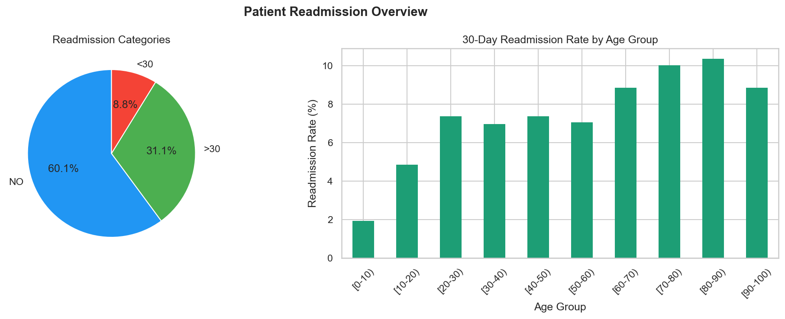
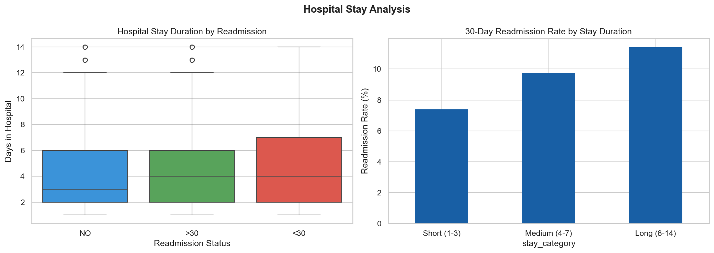
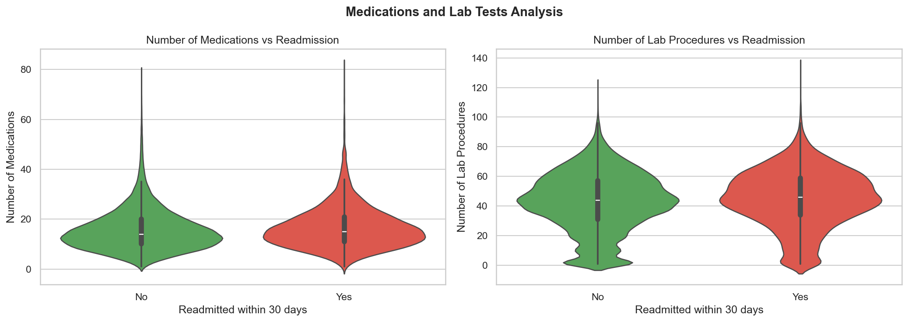
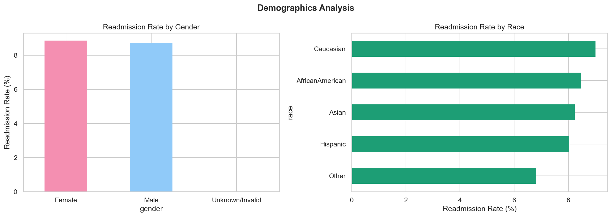
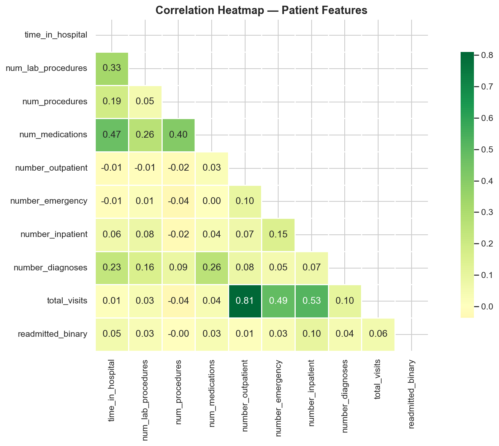
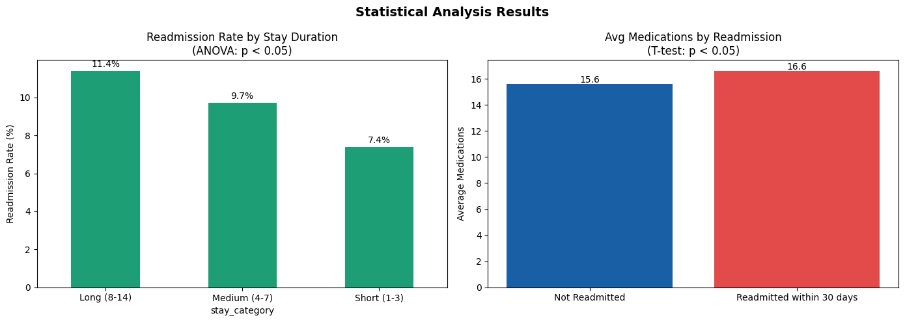

#  Patient Readmission Risk Analysis

[Dashboard](dashboard)

A complete data analytics project focused on analyzing hospital readmissions and identifying key risk factors using statistical analysis and visualization.

 Built to simulate real-world healthcare analytics and decision support systems.

---

##  Project Overview

This project analyzes a real-world **diabetes patient dataset** containing over 100,000 hospital records.

The analysis focuses on understanding patterns behind **30-day readmissions**, a critical healthcare metric impacting cost and quality of care.

###  Objectives:

* Identify key factors influencing patient readmission
* Analyze patient demographics and clinical features
* Perform statistical validation (ANOVA, T-Test)
* Discover patterns in hospital stay and treatment
* Deliver insights through visualizations and dashboard

---

## Architecture

```id="arch01"
Raw Data (CSV)
    ↓
Data Cleaning & Preprocessing (Pandas)
    ↓
Exploratory Data Analysis (EDA)
    ↓
Statistical Testing (SciPy)
    ↓
Insights & Visualization (Matplotlib, Seaborn)
    ↓
Tableau Dashboard
```

---

##  Project Structure

```id="struct01"
Patient-Readmission-Risk-Analysis/
│
├── notebooks/
│   ├── 01_eda.ipynb
│   ├── 02_statistical_analysis.ipynb
│   └── 03_final_export.ipynb
│
├── data/
│   ├── raw/
│   │   └── diabetic_data.csv
│   ├── processed/
│   │   └── clean_patients.csv
│
├── dashboard/
│   └── Patient-Readmission-Risk-Analysis.twb
│
├── images/
│   ├── readmission_overview.png
│   ├── hospital_stay.png
│   ├── medications_labs.png
│   ├── demographics.png
│   ├── correlation_heatmap.png
│   └── statistical_results.png
│
├── requirements.txt
├── .gitignore
└── README.md
```

---

## 🚀 How to Run

1. Clone the repository

```id="run01"
git clone https://github.com/YOUR_USERNAME/Patient-Readmission-Risk-Analysis
```

2. Install dependencies

```id="run02"
pip install -r requirements.txt
```

3. Run notebooks in order:

* 01_eda.ipynb
* 02_statistical_analysis.ipynb
* 03_final_export.ipynb

4. Open Tableau dashboard:

```id="run03"
dashboard/Patient-Readmission-Risk-Analysis.twb
```

---

##  Dashboard Preview








---

##  Key Features

* End-to-end healthcare data analysis pipeline
* Statistical hypothesis testing (ANOVA, T-Test)
* Feature analysis for patient behavior
* Multi-dimensional visualization (age, stay, treatment, demographics)
* Interactive Tableau dashboard

---

##  Statistical Analysis

### Readmission vs Stay Duration

* Test: ANOVA
* Result: **Statistically Significant (p < 0.05)**
* Insight: Longer hospital stays increase readmission risk

### Medications vs Readmission

* Test: T-Test
* Result: **Statistically Significant (p < 0.05)**
* Insight: Higher medication count is associated with readmission

---

##  Key Insights

* Majority of patients (60%) are not readmitted
* Readmission risk increases significantly with age
* Patients aged **70+** show highest readmission rates
* Longer hospital stays correlate with higher readmission probability
* Readmitted patients receive more medications and lab tests
* Demographic differences exist but are relatively minor

---

##  Business Impact

* Helps hospitals identify high-risk patients
* Supports better discharge planning strategies
* Reduces healthcare costs due to avoidable readmissions
* Improves patient care and monitoring systems

---

##  Tech Stack

| Category        | Tools                 |
| --------------- | --------------------- |
| Data Processing | Python, Pandas, NumPy |
| Visualization   | Matplotlib, Seaborn   |
| Statistics      | SciPy                 |
| Dashboard       | Tableau               |
| Environment     | Jupyter Notebook      |
| Version Control | Git, GitHub           |

---

##  Dataset

Dataset: Diabetes Patient Dataset
Source: https://www.kaggle.com/datasets/uciml/diabetes-130-us-hospitals-for-years-1999-2008

---

##  Author

**Saurabh Yadav**
Aspiring Data Analyst | Python | SQL | Data Visualization

---

## If you found this useful

Give this repository a star ⭐ and feel free to fork!
